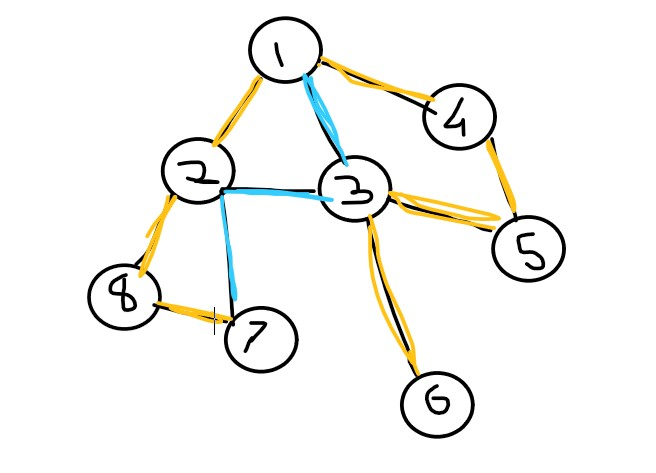

# Graph Theory 

### Cycle detection : Cycle has important property of, it provides multiple paths between two nodes. A cycle exits in an undirected graph if it has a back-edge, A back-edge is an edge of some node v with it's non parent ancestor, so to check for cycle, we need to find out for any node v we need to check if any of it's non-parent ancestor's are visited or not, if yes return true. 

### InOut Time of a graph help us in Answring queries related to if a node v lies in the subtree of another node u in O(1) time per query, if a node v lies in a subtree of node u then, In-time of v will be higher than In-time of u and Out-time of v will be smaller than out-time of u, ie.( Node[v].in > Node[u].in and Node[v].out < Node[v].out ).

### Bridges : A Bridge is an edge which when removed will disconnect the graph, or it increases the number of connected components in the graph. While making a depth first search the DFS-tree when traversed leaves some edges untouched hence a tree, called as a DFS-tree. As shown in below figure, The edges marked yellow from a DFS-tree are also known as forward-edges, and the ones marked in blue are back-edges ( A back edge is an edge that joins a node to a non direct-parent ancestor, this edge is also used in detection of cycle in a graph, ie. a presence of back-edge indicates that the graph has a cycle ) And with this observation we can conclude that a back-edge can never be a bridge and hence removing these edges does not make the graph disconnected. This makes forward-edges the only candidates for bridges. 
    

### ArticulationPoints : aka Cut vertex, these are nodes which when removed makes the graph disconnected.   
